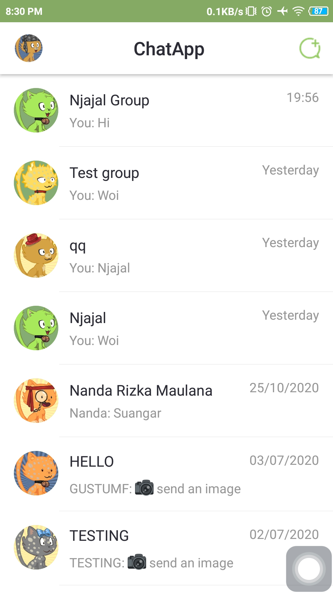
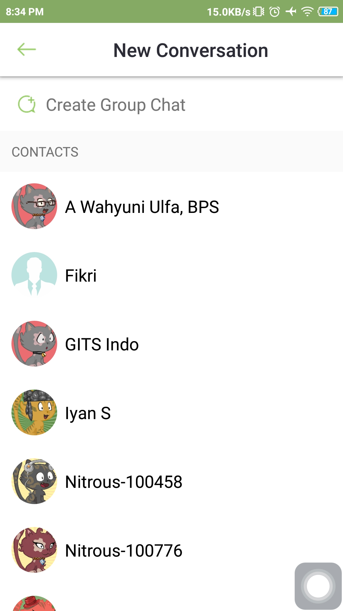
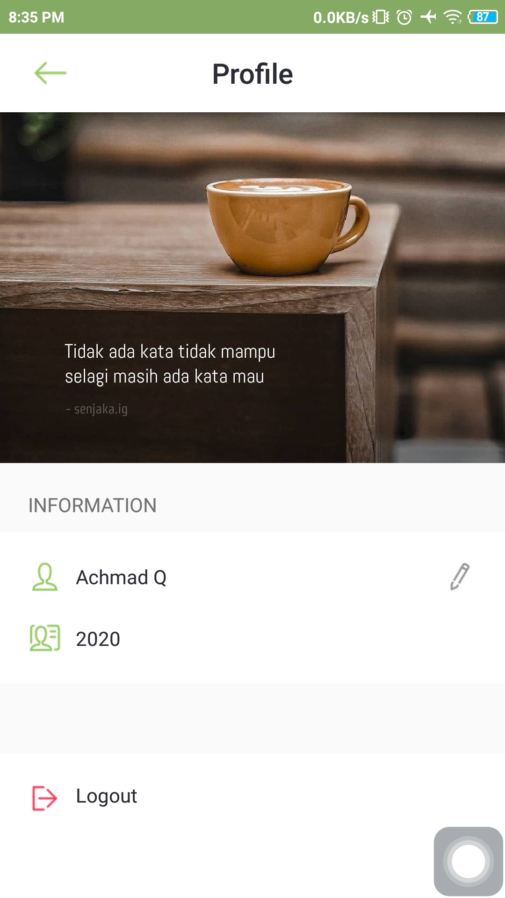
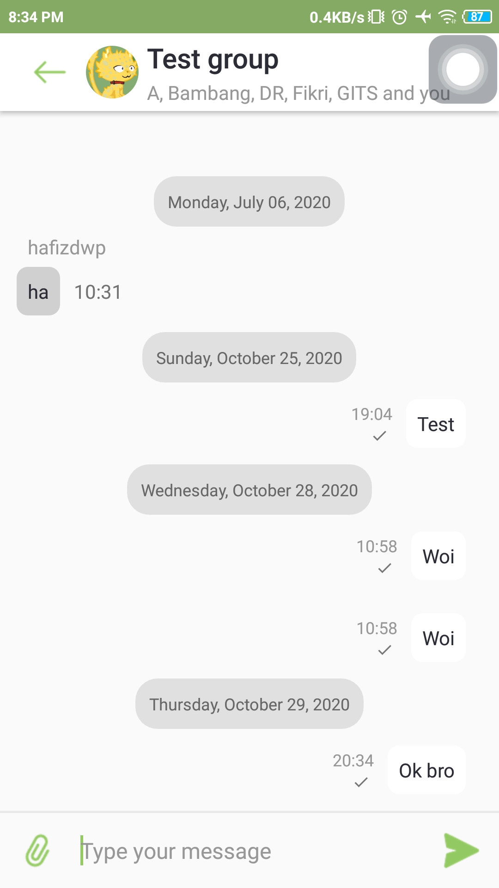
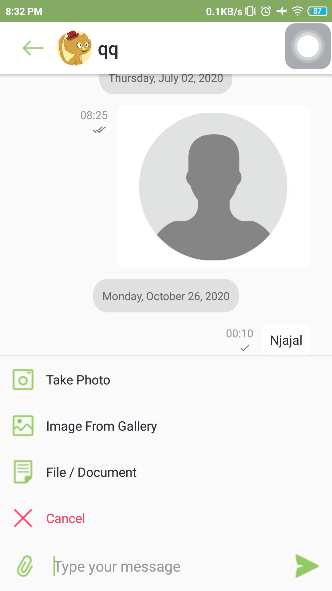
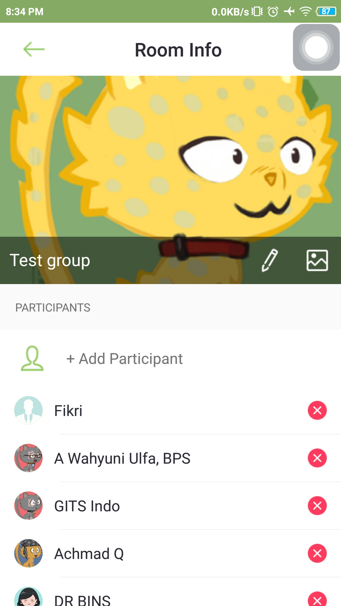

# ChatApp

[](https://www.android.com)
[](https://www.apache.org/licenses/LICENSE-2.0.html)
[](https://docs.gradle.org/current/release-notes)
[](https://java-lang.github.io/awesome-java)

💬 Chat Application using Qiscus Chat SDK. based on Android application that uses the clean architecture approach and is written in Java with full functionalities so that you can figure out the flow and main activities of common Chat apps.

# Source
Repo to demonstrate ChatApp in Android app. This is a follow up on the github at :

[SampleQiscusChatSDK](https://github.com/qiscus/qiscus-chat-sdk-android-sample)

# Instruction

- Android Studio  : Menu Build -> Clean Project -> Run (Shift + F10)
- Terminal
 
 ```
 $cd /path/to/project
 $./gradlew assembleDebug
 ```
- Check out this documentation for more information ([docs](https://documentation.qiscus.com/chat-sdk-android/introduction))

# Demo App

<p align="center">
  <a href="https://github.com/achmadqomarudin/ChatApp/releases/latest/download/app-demo.apk">
    
  </a>
</p>

<table style="width:100%">
  <tr>
    <th>Example 1</th>
    <th>Example 2</th>
    <th>Example 3</th>
  </tr>
  <tr>
    <td></td>
    <td></td>
    <td></td>
  </tr>
  <tr>
    <th>Example 4</th>
    <th>Example 5</th>
    <th>Example 6</th>
  </tr>
  <tr>
    <td></td>
    <td></td>
    <td></td>
  </tr>
</table>

# License

```
    Copyright (C) Achmad Qomarudin

    Licensed under the Apache License, Version 2.0 (the "License");
    you may not use this file except in compliance with the License.
    You may obtain a copy of the License at

       http://www.apache.org/licenses/LICENSE-2.0

    Unless required by applicable law or agreed to in writing, software
    distributed under the License is distributed on an "AS IS" BASIS,
    WITHOUT WARRANTIES OR CONDITIONS OF ANY KIND, either express or implied.
    See the License for the specific language governing permissions and
    limitations under the License.
```
